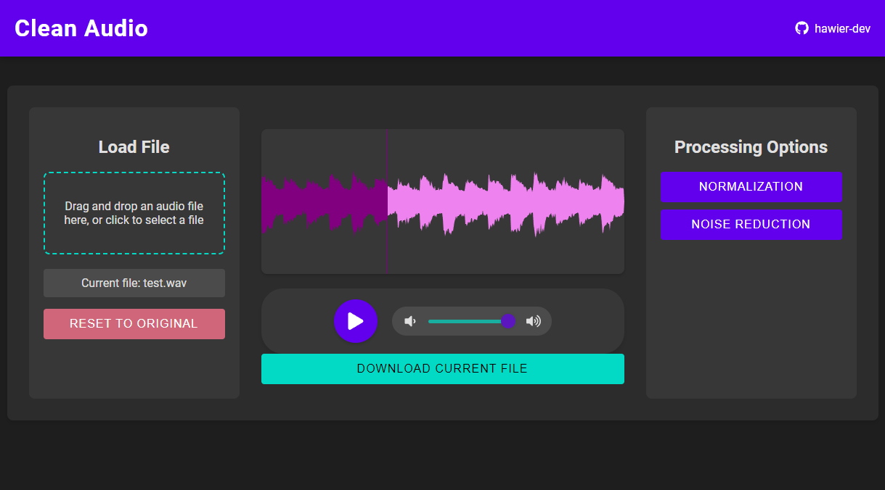

# Clean Audio



Clean Audio is a web application for processing and cleaning audio files. It provides a user-friendly interface for normalizing audio and reducing noise in audio recordings.

## Features

- Drag and drop audio file upload
- Audio waveform visualization
- Real-time audio playback with volume control
- Audio normalization
- Noise reduction

## Technologies Used

- Frontend: React.js
- Backend: Flask (Python)
- Audio Processing: pydub, noisereduce
- Waveform Visualization: wavesurfer.js

## Getting Started

### Prerequisites

- Node.js
- Python 3.7+

### Installation

1. Clone the repository:

```text
git clone https://github.com/hawier-dev/clean-audio.git
cd clean-audio
```

2. Set up the backend:

```text
cd backend
python -m venv venv
source venv/bin/activate
pip install -r requirements.txt
```

3. Set up the frontend:

```text
cd ../frontend
npm install
```

### Running the Application

1. Start the backend server:

```text
cd backend
python app.py
```

2. In a new terminal, start the frontend:

```text
cd frontend
npm start
```

3. Open your browser and navigate to `http://localhost:3000`

## Usage

1. Drag and drop an audio file or click to select one.
2. Use the buttons on the right to apply audio processing.
3. Play the processed audio using the controls at the bottom.
4. Download the processed file when satisfied with the results.

## License

This project is licensed under the MIT License - see the [LICENSE](LICENSE) file for details.

## Acknowledgments

- [wavesurfer.js](https://wavesurfer-js.org/) for audio visualization
- [pydub](https://github.com/jiaaro/pydub) for audio processing
- [noisereduce](https://github.com/timsainb/noisereduce) for noise reduction algorithms
